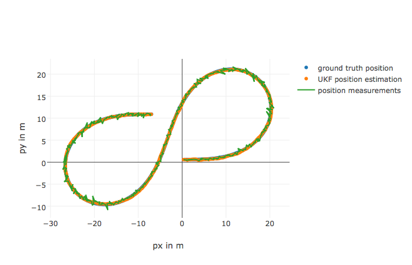
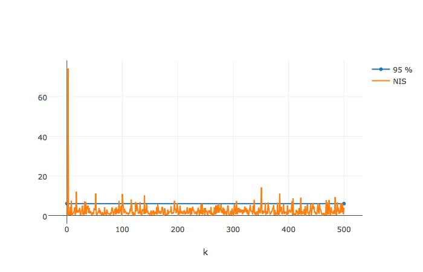

## Unscented Kalman Filter Project Starter Code

Self-Driving Car Engineer Nanodegree Program

### Dependencies

* cmake >= v3.5
* make >= v4.1
* gcc/g++ >= v5.4

### Basic Build Instructions
* Clone this repo.
* Make a build directory: mkdir build && cd build
* Compile: cmake .. && make
* Run it: ./UnscentedKF path/to/input.txt path/to/output.txt. You can find some sample inputs in 'data/'.
eg. ./UnscentedKF ../data/sample-laser-radar-measurement-data-1.txt output.txt


#### Output for obj_pose-laser-radar-synthetic-input.txt test file



#### NIS metric




```python

```
